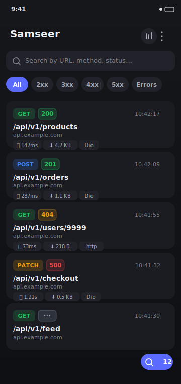
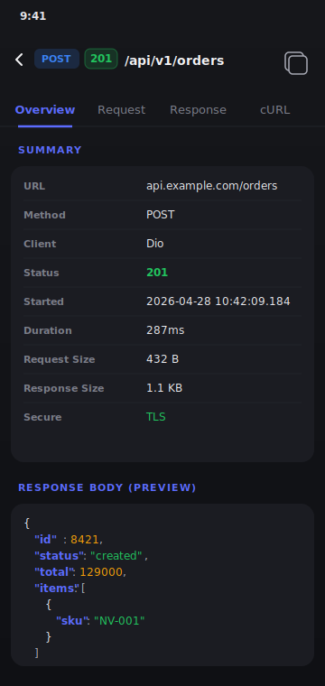
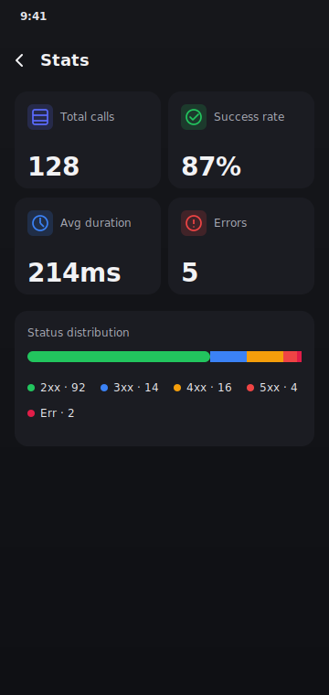

# Samseer

> Beautiful HTTP inspector for Flutter — a modern, all-in-one alternative to Alice, in a single package.

[](https://pub.dev/packages/samseer)
[](LICENSE)
[](https://pub.dev/packages/flutter_lints)

Samseer captures every HTTP request your Flutter app makes — from **Dio**, the **`http`** package, and **`dart:io` HttpClient** — and presents it in a polished Material 3 inspector you can open with a shake, a tap on a floating bubble, or a single line of code.

If you've used [Alice](https://pub.dev/packages/alice) or [Chuck](https://github.com/jhomlala/chucker_flutter), Samseer is the spiritual successor: **same idea, modern UI, single dependency, no separate adapter packages**.

<p align="center">
  
  
  
</p>

---

## ✨ Features

- 🎨 **Material 3 UI** with light & dark themes that follow the host app
- 🔌 **Three HTTP clients out of the box** — Dio, `http`, `dart:io HttpClient` — no extra packages
- 🔍 **Powerful call list** with live search, status & method filters
- 📑 **Tabbed call detail** — Overview · Request · Response · cURL
- 🌈 **Syntax-highlighted JSON viewer** built in
- 📊 **Stats screen** — totals, success rate, avg duration, status distribution
- 📱 **Shake-to-open** the inspector from anywhere in your app
- 💬 **Floating bubble overlay** with live call count (draggable)
- 📤 **Export & share** all calls as JSON, or copy any request as cURL
- 🪶 **Single dependency** — `samseer` and you're done. No `samseer_dio`, `samseer_http` etc.

---

## 🚀 Quick start

```yaml
# pubspec.yaml
dependencies:
  samseer: ^0.1.0
```

```dart
import 'dart:io';
import 'package:dio/dio.dart';
import 'package:flutter/material.dart';
import 'package:http/http.dart' as http;
import 'package:samseer/samseer.dart';

final samseer = Samseer();

void main() {
  // Dio
  final dio = Dio()..interceptors.add(samseer.dioInterceptor);

  // http package
  final httpClient = samseer.httpClient();

  // dart:io HttpClient (intercepts every HttpClient created globally)
  HttpOverrides.global = samseer.httpOverrides;

  runApp(const MyApp());
}

class MyApp extends StatelessWidget {
  const MyApp({super.key});

  @override
  Widget build(BuildContext context) {
    return MaterialApp(
      navigatorKey: samseer.navigatorKey, // required for shake & bubble
      home: const HomeScreen(),
    );
  }
}
```

That's it. Shake your phone or call `samseer.showInspector()` to open the inspector.

---

## 🧩 Integrations

### Dio

```dart
final dio = Dio();
dio.interceptors.add(samseer.dioInterceptor);
```

### `http` package

`samseer.httpClient()` returns a drop-in `http.Client` replacement. Pass an existing client to wrap it:

```dart
final client = samseer.httpClient();
// or wrap an existing one
final wrapped = samseer.httpClient(myExistingClient);

final response = await client.get(Uri.parse('https://api.example.com/me'));
```

### `dart:io` HttpClient

Install `HttpOverrides` once at app startup. Every `HttpClient` created anywhere in your app — including those used by `package:http`, Firebase, image libraries, etc. — will be recorded:

```dart
HttpOverrides.global = samseer.httpOverrides;
```

> 💡 If you set `HttpOverrides.global` you typically don't need `samseer.httpClient()` separately, since the `http` package uses `dart:io` HttpClient under the hood.

### Multiple clients at once

You can use all three integrations simultaneously. Samseer assigns a fresh ID per call so nothing is duplicated.

---

## 🎯 Opening the inspector

| Trigger | How |
|---|---|
| Shake the device | enabled by default; configure with `SamseerConfiguration(showInspectorOnShake: false)` to disable |
| Floating bubble | wrap your app: `MaterialApp(builder: (_, child) => samseer.overlay(child: child!))` |
| Programmatic | `samseer.showInspector()` (needs `navigatorKey`) or `samseer.showInspectorFromContext(context)` |
| From a debug button | wire `onPressed: samseer.showInspector` to any button or FAB |

---

## ⚙️ Configuration

```dart
final samseer = Samseer(
  configuration: const SamseerConfiguration(
    maxCallsCount: 500,
    showInspectorOnShake: true,
    showFloatingBubble: false,
    themeMode: ThemeMode.system,
    shakeThreshold: 20,
  ),
);
```

| Option | Default | Description |
|---|---|---|
| `maxCallsCount` | `1000` | Older calls are evicted FIFO once the limit is hit |
| `showInspectorOnShake` | `true` | Shake the device to open the inspector |
| `showFloatingBubble` | `false` | Set to `true` and wrap with `samseer.overlay(...)` |
| `themeMode` | `ThemeMode.system` | Forces light/dark theme of the inspector |
| `shakeThreshold` | `20` (m/s²) | Higher value = harder shake required |
| `directionality` | `null` | Force RTL/LTR inside the inspector |

---

## 🔄 Migrating from Alice

| Alice | Samseer |
|---|---|
| `Alice` | `Samseer` |
| `alice.getNavigatorKey()` | `samseer.navigatorKey` |
| `dio.interceptors.add(AliceDioAdapter(...))` | `dio.interceptors.add(samseer.dioInterceptor)` |
| `AliceHttpAdapter` | `samseer.httpClient()` (drop-in `http.Client`) |
| `AliceHttpClientAdapter` | `samseer.httpOverrides` (global HttpOverrides) |
| `alice.showInspector()` | `samseer.showInspector()` |
| Multiple packages (`alice_dio`, `alice_http`, ...) | One package — `samseer` |

Why switch?

- 🪄 **Single dependency** instead of 3-5 separate adapter packages.
- 🎨 **Modern Material 3 UI** with proper light/dark mode and Google Fonts typography.
- 📑 **Tabbed call detail** with built-in JSON syntax highlighting and one-tap cURL copy.
- 💬 **Floating bubble** as a more ergonomic alternative to system notifications.

---

## 🧪 Example

A complete example is in [`example/`](example/lib/main.dart). Run it:

```sh
cd example
flutter run
```

Tap any of the buttons to fire requests — they'll appear in the inspector live.

---

## 📦 What's included vs not (yet)

✅ **Included in 0.1.x**

- Dio + `http` + `HttpClient` interception
- Material 3 inspector UI (list, detail, stats)
- JSON viewer, cURL export, file export
- Shake detection, floating bubble
- In-memory storage with FIFO eviction

🛣️ **Roadmap**

- Persistent storage (Hive/Isar) so calls survive app restart
- Chopper, GraphQL, Cronet integrations
- Mock-and-replay (intercept and override responses for testing)
- Web + Desktop platform polish (currently mobile-first)
- Built-in Sentry/Crashlytics breadcrumb hooks

---

## 🤝 Contributing

PRs welcome! Run the example app, write a test for any new behavior, and keep the public API surface small.

```sh
flutter analyze
flutter test
```

---

## 📜 License
2026 Samuel Jiwandono
