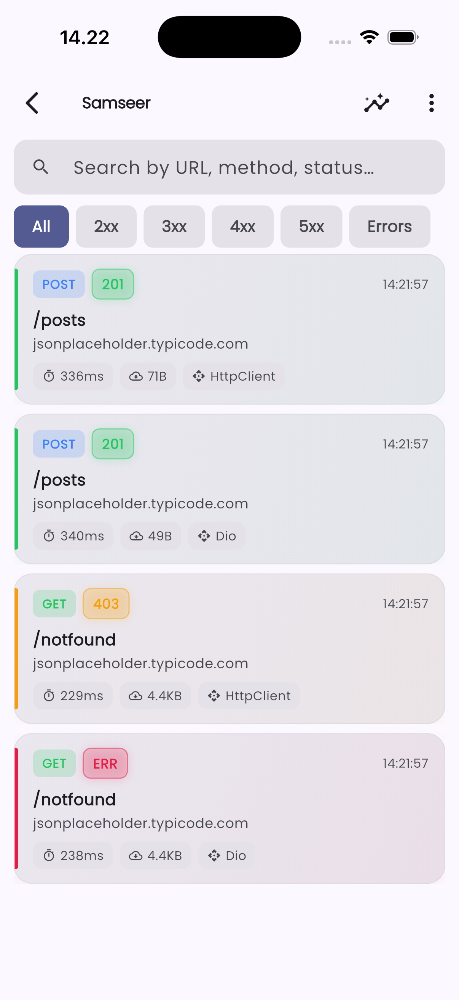
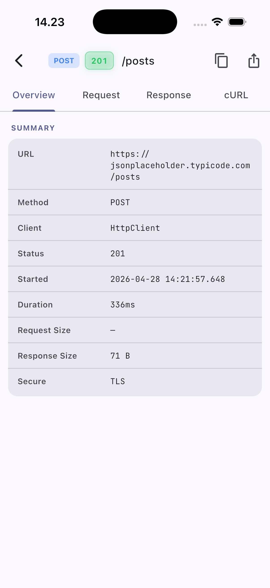
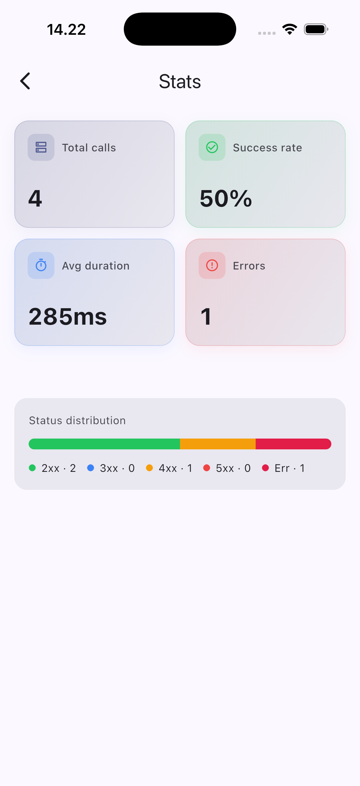
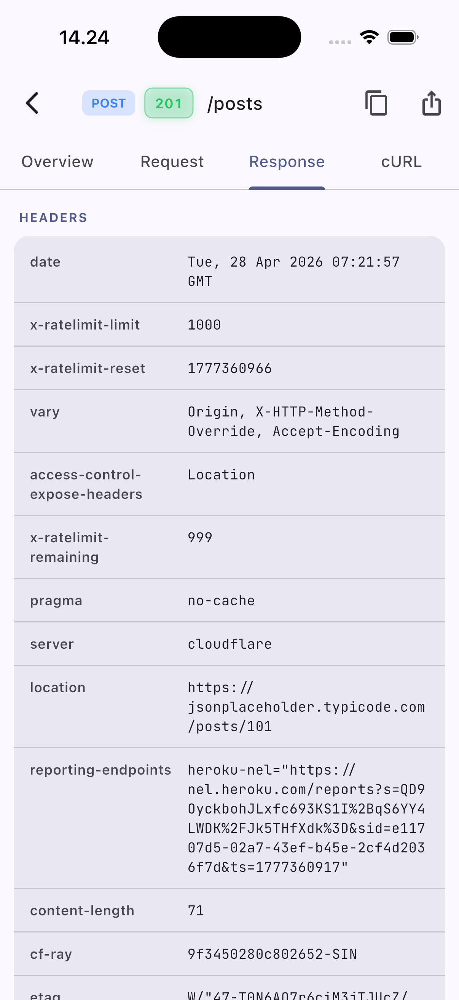
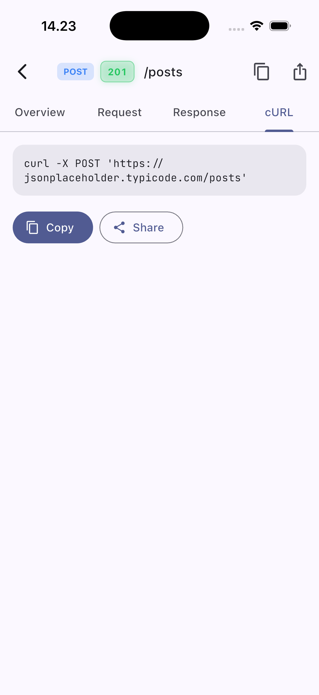

# Samseer

> Beautiful HTTP inspector for Flutter — a modern, all-in-one alternative to Alice, in a single package.

[](https://pub.dev/packages/samseer)
[](https://pub.dev/packages/flutter_lints)
[](#-contribute-with-us)
[](https://github.com/sponsors/samueljiwandono0310)

Samseer captures every HTTP request your Flutter app makes — from **Dio**, the **`http`** package, and **`dart:io` HttpClient** — and presents it in a polished Material 3 inspector you can open with a shake, a tap on a floating bubble, or a single line of code.

If you've used [Alice](https://pub.dev/packages/alice) or [Chuck](https://github.com/jhomlala/chucker_flutter), Samseer is the spiritual successor: **same idea, modern UI, single dependency, no separate adapter packages**.

<p align="center">
  
  
  
</p>

<p align="center">
  
  
</p>

---

## ✨ Features

- 🎨 **Material 3 UI** with light & dark themes that follow the host app
- 🔌 **Three HTTP clients out of the box** — Dio, `http`, `dart:io HttpClient` — no extra packages
- 🌐 **WebView traffic too** — drop-in JS interceptor for XHR/`fetch` inside `flutter_inappwebview`, no extra dep on Samseer's side
- 🔍 **Powerful call list** with live search, status & method filters
- 📑 **Tabbed call detail** — Overview · Request · Response · cURL
- 🌈 **Syntax-highlighted JSON viewer** built in
- 📊 **Stats screen** — totals, success rate, avg duration, status distribution
- 📱 **Shake-to-open** the inspector from anywhere in your app
- 💬 **Floating bubble overlay** with live call count (draggable)
- 📤 **Export & share** all calls as JSON, or copy any request as cURL
- 🪶 **Single dependency** — `samseer` and you're done. No `samseer_dio`, `samseer_http` etc.

---

## 🚀 Quick start

```yaml
# pubspec.yaml
dependencies:
  samseer: ^0.1.0
```

```dart
import 'dart:io';
import 'package:dio/dio.dart';
import 'package:flutter/material.dart';
import 'package:http/http.dart' as http;
import 'package:samseer/samseer.dart';

final samseer = Samseer();

void main() {
  // Dio
  final dio = Dio()..interceptors.add(samseer.dioInterceptor);

  // http package
  final httpClient = samseer.httpClient();

  // dart:io HttpClient (intercepts every HttpClient created globally)
  HttpOverrides.global = samseer.httpOverrides;

  runApp(const MyApp());
}

class MyApp extends StatelessWidget {
  const MyApp({super.key});

  @override
  Widget build(BuildContext context) {
    return MaterialApp(
      navigatorKey: samseer.navigatorKey, // required for shake & bubble
      home: const HomeScreen(),
    );
  }
}
```

That's it. Shake your phone or call `samseer.showInspector()` to open the inspector.

---

## 🧩 Integrations

### Dio

```dart
final dio = Dio();
dio.interceptors.add(samseer.dioInterceptor);
```

### `http` package

`samseer.httpClient()` returns a drop-in `http.Client` replacement. Pass an existing client to wrap it:

```dart
final client = samseer.httpClient();
// or wrap an existing one
final wrapped = samseer.httpClient(myExistingClient);

final response = await client.get(Uri.parse('https://api.example.com/me'));
```

### `dart:io` HttpClient

Install `HttpOverrides` once at app startup. Every `HttpClient` created anywhere in your app — including those used by `package:http`, Firebase, image libraries, etc. — will be recorded:

```dart
HttpOverrides.global = samseer.httpOverrides;
```

> 💡 If you set `HttpOverrides.global` you typically don't need `samseer.httpClient()` separately, since the `http` package uses `dart:io` HttpClient under the hood.

### Multiple clients at once

You can use all three integrations simultaneously. Samseer assigns a fresh ID per call so nothing is duplicated.

---

## 🎯 Opening the inspector

| Trigger | How |
|---|---|
| Shake the device | enabled by default; configure with `SamseerConfiguration(showInspectorOnShake: false)` to disable |
| Floating bubble | wrap your app: `MaterialApp(builder: (_, child) => samseer.overlay(child: child!))` |
| Programmatic | `samseer.showInspector()` (needs `navigatorKey`) or `samseer.showInspectorFromContext(context)` |
| From a debug button | wire `onPressed: samseer.showInspector` to any button or FAB |

---

## 🔔 Notifications (optional)

Want to be pinged on every HTTP call without leaving your screen? Samseer exposes `samseer.callsStream` so you can drive **any** notification system you already use. The example below uses [`flutter_local_notifications`](https://pub.dev/packages/flutter_local_notifications), but the same pattern works with Firebase Messaging, Awesome Notifications, or your own in-app banner.

> Samseer does **not** depend on `flutter_local_notifications` — you stay in control of the notification stack.

A minimal bridge:

```dart
import 'dart:async';
import 'package:flutter_local_notifications/flutter_local_notifications.dart';
import 'package:samseer/samseer.dart';

class SamseerNotificationBridge {
  SamseerNotificationBridge({required this.samseer, required this.plugin});
  final Samseer samseer;
  final FlutterLocalNotificationsPlugin plugin;

  static const int _id = 9999;
  final Set<int> _seen = {};
  StreamSubscription<List<SamseerHttpCall>>? _sub;

  void start() {
    for (final c in samseer.calls) {
      if (!c.loading) _seen.add(c.id);
    }
    _sub = samseer.callsStream.listen((calls) {
      for (final c in calls) {
        if (!c.loading && _seen.add(c.id)) _emit(c);
      }
      _seen.retainAll(calls.map((c) => c.id).toSet());
    });
  }

  bool handleTap(NotificationResponse r) {
    if (r.id != _id) return false;
    samseer.showInspector();
    return true;
  }

  void _emit(SamseerHttpCall c) {
    final status = c.status?.toString() ?? (c.hasError ? 'ERR' : '-');
    plugin.show(
      _id,
      '[${c.method}] $status ${c.endpoint.isEmpty ? c.uri : c.endpoint}',
      c.error?.message ?? c.uri,
      const NotificationDetails(
        android: AndroidNotificationDetails(
          'samseer', 'Samseer HTTP calls',
          importance: Importance.max, priority: Priority.high,
        ),
        iOS: DarwinNotificationDetails(presentAlert: true, presentBanner: true),
      ),
    );
  }

  Future<void> dispose() async => _sub?.cancel();
}
```

Wire it up at startup:

```dart
final notifications = FlutterLocalNotificationsPlugin();
final bridge = SamseerNotificationBridge(samseer: samseer, plugin: notifications);

await notifications.initialize(
  const InitializationSettings(
    android: AndroidInitializationSettings('@mipmap/ic_launcher'),
    iOS: DarwinInitializationSettings(
      requestAlertPermission: true,
      requestBadgePermission: true,
      requestSoundPermission: true,
    ),
  ),
  onDidReceiveNotificationResponse: bridge.handleTap,
);

bridge.start();
```

Why this design?

- **Reuses one notification id** (`9999`) so the system replaces the previous notification — your tray doesn't fill up after a chatty screen.
- **Marks existing calls as already-notified** in `start()`, so re-attaching the bridge after a hot-reload doesn't spam you with a backlog.
- **`handleTap` returns `bool`**, so you can chain it with your own notification handlers — return `true` only if it was Samseer's, otherwise fall through.

A complete, runnable version lives in [`example/lib/samseer_notification_bridge.dart`](example/lib/samseer_notification_bridge.dart).

> 💡 Heads up: on Android 13+ you'll need the `POST_NOTIFICATIONS` runtime permission, and on iOS the system asks the user the first time the plugin initializes. Keep this integration **debug-only** — guard it behind `kDebugMode` or a flavor flag so it never ships in production.

---

## 🌐 WebView inspector (optional)

Want to inspect XHR and `fetch` calls happening **inside a WebView page** — the way Chrome DevTools' Network tab shows them? Samseer ships a self-contained JavaScript snippet plus a tiny Dart bridge so you can wire it into [`flutter_inappwebview`](https://pub.dev/packages/flutter_inappwebview) (or any WebView library that supports user scripts and JS-to-Dart channels).

> Samseer does **not** depend on `flutter_inappwebview`. You bring your own WebView and pass two things across: the script and the handler.

```dart
import 'dart:collection';
import 'package:flutter/material.dart';
import 'package:flutter_inappwebview/flutter_inappwebview.dart';
import 'package:samseer/samseer.dart';

class MyWebViewPage extends StatelessWidget {
  const MyWebViewPage({super.key, required this.samseer, required this.url});
  final Samseer samseer;
  final Uri url;

  @override
  Widget build(BuildContext context) {
    return Scaffold(
      appBar: AppBar(title: const Text('WebView')),
      body: InAppWebView(
        initialUrlRequest: URLRequest(url: WebUri(url.toString())),
        initialUserScripts: UnmodifiableListView<UserScript>([
          UserScript(
            source: webViewInterceptorScript,
            injectionTime: UserScriptInjectionTime.AT_DOCUMENT_START,
          ),
        ]),
        onWebViewCreated: (controller) {
          controller.addJavaScriptHandler(
            handlerName: 'samseer_webview',
            callback: (args) {
              if (args.isNotEmpty) samseer.recordWebViewEvent(args.first);
            },
          );
        },
      ),
    );
  }
}
```

How it works:

- `webViewInterceptorScript` is a string constant that monkey-patches `XMLHttpRequest` and `fetch` inside the page. Inject it at **document start** so it wraps the JS APIs before any application code runs.
- Each request, response, and error is forwarded to the `samseer_webview` JavaScript handler. `samseer.recordWebViewEvent(args.first)` translates the payload into a regular Samseer call, indistinguishable from Dio/`http`/`HttpClient` entries (just labelled `client: WebView`).
- Re-installation is idempotent — guarded internally by a `__samseer_installed` flag — so revisiting pages is safe.

Limitations to know:

- Only **XHR and `fetch`** are captured. Static resources (images, CSS, fonts) and main-frame navigation are not — those don't typically appear in DevTools' Fetch/XHR filter either.
- Streaming / opaque responses (CORS `no-cors`, SSE) record with `body: null` — Samseer doesn't try to read past the headers in those cases.
- Each response body is held in memory once before being forwarded; if your page downloads very large payloads, consider whether you want this active in production.

> 💡 Like the notification bridge, treat this as a **debug-only** integration — guard the script injection behind `kDebugMode` or a build flavor so it doesn't ship in release builds.

A complete, runnable demo lives in [`example/lib/samseer_webview_demo_page.dart`](example/lib/samseer_webview_demo_page.dart).

---

## ⚙️ Configuration

```dart
final samseer = Samseer(
  configuration: const SamseerConfiguration(
    maxCallsCount: 500,
    showInspectorOnShake: true,
    showFloatingBubble: false,
    themeMode: ThemeMode.system,
    shakeThreshold: 20,
  ),
);
```

| Option | Default | Description |
|---|---|---|
| `maxCallsCount` | `1000` | Older calls are evicted FIFO once the limit is hit |
| `showInspectorOnShake` | `true` | Shake the device to open the inspector |
| `showFloatingBubble` | `false` | Set to `true` and wrap with `samseer.overlay(...)` |
| `themeMode` | `ThemeMode.system` | Forces light/dark theme of the inspector |
| `shakeThreshold` | `20` (m/s²) | Higher value = harder shake required |
| `directionality` | `null` | Force RTL/LTR inside the inspector |

---

## 🔄 Migrating from Alice

| Alice | Samseer |
|---|---|
| `Alice` | `Samseer` |
| `alice.getNavigatorKey()` | `samseer.navigatorKey` |
| `dio.interceptors.add(AliceDioAdapter(...))` | `dio.interceptors.add(samseer.dioInterceptor)` |
| `AliceHttpAdapter` | `samseer.httpClient()` (drop-in `http.Client`) |
| `AliceHttpClientAdapter` | `samseer.httpOverrides` (global HttpOverrides) |
| `alice.showInspector()` | `samseer.showInspector()` |
| Multiple packages (`alice_dio`, `alice_http`, ...) | One package — `samseer` |

Why switch?

- 🪄 **Single dependency** instead of 3-5 separate adapter packages.
- 🎨 **Modern Material 3 UI** with proper light/dark mode and Google Fonts typography.
- 📑 **Tabbed call detail** with built-in JSON syntax highlighting and one-tap cURL copy.
- 💬 **Floating bubble** as a more ergonomic alternative to system notifications.

---

## 🧪 Example

A complete example is in [`example/`](example/lib/main.dart). Run it:

```sh
cd example
flutter run
```

Tap any of the buttons to fire requests — they'll appear in the inspector live.

---

## 📦 What's included vs not (yet)

✅ **Included in 0.1.x**

- Dio + `http` + `HttpClient` interception
- Material 3 inspector UI (list, detail, stats)
- JSON viewer, cURL export, file export
- Shake detection, floating bubble
- In-memory storage with FIFO eviction

🛣️ **Roadmap**

- Persistent storage (Hive/Isar) so calls survive app restart
- Chopper, GraphQL, Cronet integrations
- Mock-and-replay (intercept and override responses for testing)
- Web + Desktop platform polish (currently mobile-first)
- Built-in Sentry/Crashlytics breadcrumb hooks

---

## 🤝 Contribute with us

Samseer is open and growing — and I'd love your help to make it the best HTTP inspector in the Flutter ecosystem. Whether you're squashing bugs, adding a new HTTP client integration, polishing the UI, or improving docs — your contribution is welcome.

**Ways to contribute**

- 🐛 **Bug reports & feature requests** — open an issue on [GitHub](https://github.com/samueljiwandono0310/samseer/issues)
- 🚀 **Code contributions** — fork, branch, send a PR. Make sure these still pass:
   ```sh
   flutter analyze
   flutter test
   ```
- 🎨 **Design feedback** — share screenshots, mockups, or UX ideas. The bar is "fancier than Alice" 😉
- 🌐 **HTTP client integrations** — Chopper, GraphQL, Cronet, etc. are on the roadmap
- 📣 **Spread the word** — star the repo, share with your team, write a blog post

**First-time contributors are very welcome.** Pick anything from the [roadmap](#-whats-included-vs-not-yet), open an issue first to discuss your approach, and let's build it together.

---

## ☕ Support this project

Samseer is built and maintained on personal time. If it saves you debugging hours, treat me to a coffee — every bit of support helps me keep building, polishing, and shipping new features.

<p align="center">
  <a href="https://github.com/sponsors/samueljiwandono0310">
    
  </a>
</p>

Sponsors get a special thank-you in the next release notes. 🙏

---

Made with 💙 by [Samuel Jiwandono](https://github.com/samueljiwandono0310) — and hopefully you next.
